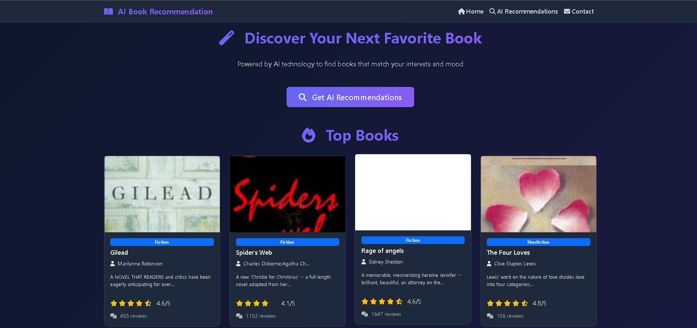
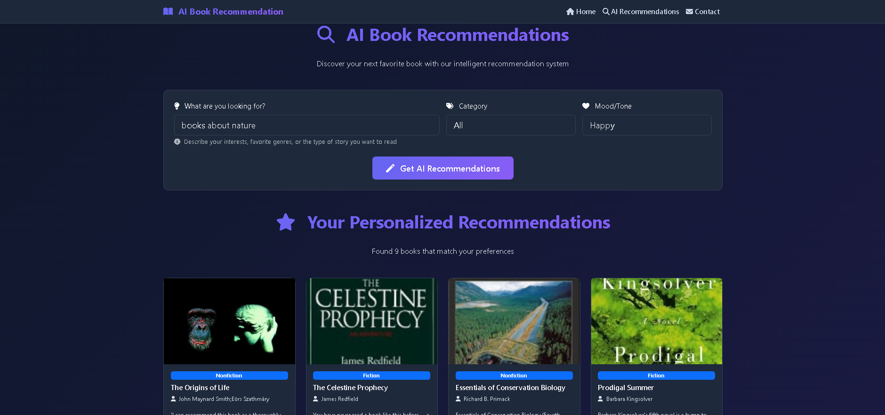
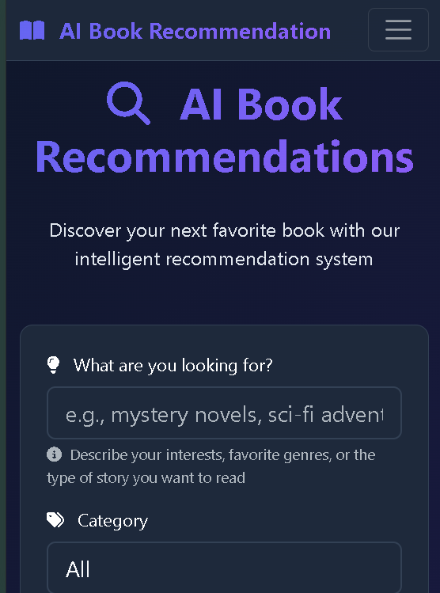
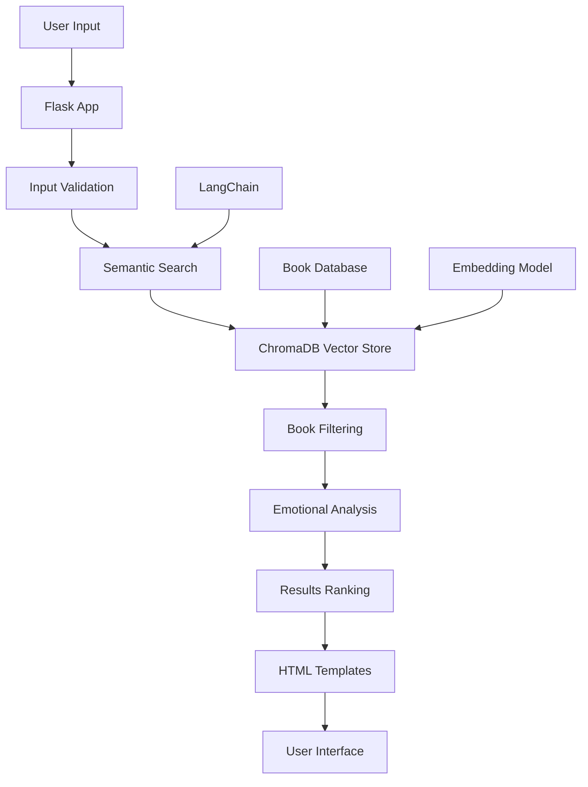

# 📚 AI Book Recommendation System

<div align="center">


**Discover your next favorite book with intelligent AI-powered recommendations**

[🚀 Live Demo](#) • [📖 Features](#-features) • [🛠️ Installation](#-installation) • [🎯 Usage](#-usage) • [🏗️ Architecture](#-architecture)

</div>

---

## 🎯 Project Overview

The **AI Book Recommendation System** is an intelligent web application that leverages advanced machine learning and natural language processing to provide personalized book recommendations. Built with Flask, LangChain, and ChromaDB, it analyzes user preferences, emotional tones, and semantic content to suggest books that match individual reading tastes.

### ✨ What Makes It Special

- 🤖 **AI-Powered**: Uses state-of-the-art sentence transformers for semantic understanding
- 🎭 **Emotional Intelligence**: Considers emotional tones (Happy, Sad, Suspenseful, etc.)
- 🎨 **Beautiful UI**: Modern, responsive design with dark theme
- ⚡ **Real-time**: Instant recommendations with smart filtering
- 📊 **Rich Data**: Comprehensive book database with ratings, reviews, and descriptions

---

## 🖼️ Screenshots & Demo

<div align="center">

### 🏠 Landing Page


### 🔍 Recommendation Interface


### 📱 Mobile Responsive


</div>

---

## 🚀 Features

### 🧠 Core Features
- **Semantic Search**: Advanced NLP-based book discovery
- **Emotional Filtering**: Filter by mood and emotional tone
- **Category Filtering**: Browse by genre and book categories
- **Smart Validation**: Input validation and error handling
- **Real-time Results**: Instant recommendation generation

### 🎨 User Experience
- **Modern UI/UX**: Beautiful dark theme with gradient accents
- **Responsive Design**: Works perfectly on all devices
- **Interactive Cards**: Hover effects and book details modal
- **Loading Animations**: Smooth transitions and feedback
- **Pagination**: Load more books with infinite scroll

### 🔧 Technical Features
- **Vector Database**: ChromaDB for efficient similarity search
- **Embedding Model**: Sentence transformers for semantic understanding
- **Data Processing**: Pandas for efficient data manipulation
- **Web Framework**: Flask for robust backend API
- **Template Engine**: Jinja2 for dynamic content rendering

---

## 🏗️ Architecture



### 🔄 Data Flow
1. **User Input**: Query + Category + Tone preferences
2. **Validation**: Input sanitization and validation
3. **Semantic Search**: Vector similarity search in ChromaDB
4. **Filtering**: Apply category and emotional tone filters
5. **Ranking**: Sort results by relevance and preferences
6. **Rendering**: Display results with beautiful UI

---

## 🛠️ Installation

### Prerequisites
- Python 3.8 or higher
- pip (Python package installer)
- Git

### Step-by-Step Setup

1. **Clone the Repository**
   ```bash
   git clone https://github.com/yourusername/ai-book-recommendation.git
   cd ai-book-recommendation
   ```

2. **Create Virtual Environment**
   ```bash
   python -m venv venv
   
   # On Windows
   venv\Scripts\activate
   
   # On macOS/Linux
   source venv/bin/activate
   ```

3. **Install Dependencies**
   ```bash
   pip install -r requirements.txt
   ```

4. **Download Required Data**
   ```bash
   # The system will automatically create ChromaDB on first run
   # Make sure you have the following files:
   # - books_with_emotions.csv
   # - isbn_desc.txt
   ```

5. **Run the Application**
   ```bash
   python app.py
   ```

6. **Access the Application**
   ```
   Open your browser and go to: http://localhost:5000
   ```

---

## 🎯 Usage

### 🏠 Home Page
- Browse featured books on the landing page
- Click "Load More" to discover additional books
- Navigate to different sections using the navigation bar

### 🔍 Getting Recommendations

1. **Navigate to Recommendations**
   - Click "Get Recommendations" in the navigation
   - Or go directly to `/recommend`

2. **Enter Your Preferences**
   - **Query**: Describe what you're looking for (e.g., "mystery novels with strong female protagonists")
   - **Category**: Select a book genre (optional)
   - **Mood/Tone**: Choose emotional tone (Happy, Sad, Suspenseful, etc.)

3. **Get Results**
   - Click "Get AI Recommendations"
   - Browse through personalized book suggestions
   - Click on book cards for more details

### 📱 Mobile Experience
- Fully responsive design
- Touch-friendly interface
- Optimized for mobile browsing

---

## 📊 Data Structure

### Book Database Schema
```csv
isbn13,title,authors,description,rating,reviews,category,joy,surprise,anger,fear,sadness
```

### Key Fields
- **isbn13**: Unique book identifier
- **title**: Book title
- **authors**: Author names
- **description**: Book description
- **rating**: Average rating (1-5)
- **reviews**: Number of reviews
- **category**: Book genre/category
- **Emotional Scores**: joy, surprise, anger, fear, sadness

---

## 🔧 Configuration

### Environment Variables
```bash
# Optional: Set Flask environment
export FLASK_ENV=development
export FLASK_DEBUG=1
```

### Customization Options
- **Embedding Model**: Change in `app.py` line 20
- **Chunk Size**: Modify text splitting in `app.py` line 30
- **Results Count**: Adjust `initial_top_k` and `final_top_k` parameters
- **UI Theme**: Customize CSS variables in `templates/base.html`

---

## 🧪 Testing

### Manual Testing
1. **Input Validation**: Test various input scenarios
2. **Recommendation Quality**: Verify recommendation relevance
3. **UI Responsiveness**: Test on different screen sizes
4. **Performance**: Check loading times and responsiveness

### Sample Test Cases
```python
# Valid queries
"mystery novels with plot twists"
"romantic stories set in Paris"
"science fiction about space exploration"

# Invalid queries (should show error)
""  # Empty query
"12"  # Only numbers
"!@#"  # Only symbols
```

---

## 🚀 Deployment

### Local Development
```bash
python app.py
```

### Production Deployment
1. **Set up a production server** (e.g., Ubuntu, CentOS)
2. **Install dependencies**:
   ```bash
   sudo apt update
   sudo apt install python3 python3-pip nginx
   ```
3. **Deploy with Gunicorn**:
   ```bash
   pip install gunicorn
   gunicorn -w 4 -b 0.0.0.0:8000 app:app
   ```
4. **Configure Nginx** as reverse proxy
5. **Set up SSL** with Let's Encrypt

### Docker Deployment
```dockerfile
FROM python:3.9-slim
WORKDIR /app
COPY requirements.txt .
RUN pip install -r requirements.txt
COPY . .
EXPOSE 5000
CMD ["python", "app.py"]
```

---

## 📈 Performance

### Optimization Features
- **Vector Database**: Fast similarity search with ChromaDB
- **Caching**: Embeddings are cached for faster retrieval
- **Lazy Loading**: Images and content loaded on demand
- **Compression**: Optimized image sizes for better performance

### Benchmarks
- **Search Speed**: < 2 seconds for recommendations
- **Database Size**: Efficient storage with vector compression
- **Memory Usage**: Optimized for production deployment

---

## 🤝 Contributing

We welcome contributions! Here's how you can help:

### 🐛 Reporting Bugs
1. Check existing issues
2. Create a new issue with detailed description
3. Include steps to reproduce
4. Add screenshots if applicable

### 💡 Suggesting Features
1. Open a feature request issue
2. Describe the feature and its benefits
3. Provide mockups or examples if possible

### 🔧 Code Contributions
1. Fork the repository
2. Create a feature branch
3. Make your changes
4. Add tests if applicable
5. Submit a pull request

### 📝 Code Style
- Follow PEP 8 guidelines
- Add docstrings for functions
- Include type hints where appropriate
- Write clear commit messages

---

## 📄 License

This project is licensed under the MIT License - see the [LICENSE](LICENSE) file for details.

---

## 🙏 Acknowledgments

- **LangChain**: For the amazing LLM framework
- **Hugging Face**: For the sentence transformer models
- **ChromaDB**: For the vector database solution
- **Bootstrap**: For the responsive UI components
- **Font Awesome**: For the beautiful icons

---

## 📞 Support

### Getting Help
- 💬 **Discussions**: [GitHub Discussions](https://github.com/yourusername/ai-book-recommendation/discussions)
- 🐛 **Issues**: [GitHub Issues](https://github.com/yourusername/ai-book-recommendation/issues)

### Documentation
- 📖 **API Docs**: [API Documentation](#)
- 🎥 **Video Tutorial**: [YouTube Tutorial](#)
- 📚 **Blog Post**: [Medium Article](#)

---

<div align="center">

**Made with ❤️ by BSSE-E21-78 Team**

[⭐ Star this repo](https://github.com/yourusername/ai-book-recommendation) • [🔄 Fork it](https://github.com/yourusername/ai-book-recommendation/fork) • [📤 Share it](https://twitter.com/intent/tweet?text=Check%20out%20this%20awesome%20AI%20Book%20Recommendation%20System!)

</div>
